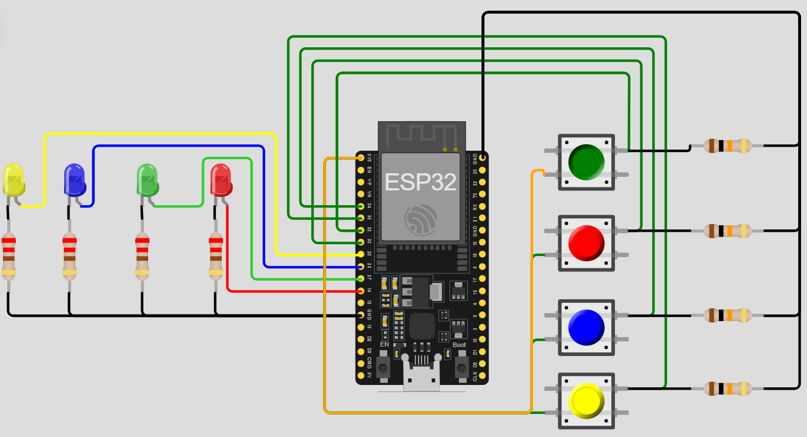

# ESP32-010-Simon-Says-Game-with-ESP32🎵
Relive the classic memory challenge with this Simon Says Game built using an ESP32, LEDs, and push buttons! The game lights up a random LED sequence, and the player must repeat it using the buttons. Each round gets harder — test how far your memory can go!

---

## 🛠 Components Required

1. [ESP32 Development Board (30-pin)](https://robocraze.com/products/nodemcu-32-wifi-bluetooth-esp32-development-board30-pin?_pos=3&_psq=ESP32&_ss=e&_v=1.0)
2. [3mm Red LED](https://robocraze.com/products/3mm-red-led-pack-of-10?_pos=2&_sid=29237540e&_ss=r)
3. [3mm Green LED](https://robocraze.com/products/3mm-green-led-pack-of-10?_pos=2&_sid=3b876becc&_ss=r)
4. [3mm Blue LED](https://robocraze.com/products/3mm-dip-diffused-blue-led-pack-of-10?_pos=2&_sid=566d81d90&_ss=r)
5. [5mm Yellow LED](https://robocraze.com/products/5mm-yellow-ledpack-of-10?_pos=7&_sid=566d81d90&_ss=r)
6. [Push Buttons](https://robocraze.com/products/4-pins-dip-momentary-square-tactile-push-button-switch-10-pieces-6x6x5mm?_pos=1&_sid=7a5518733&_ss=r)
7. [220Ω Resistors](https://robocraze.com/products/220-ohm-resistor-pack-of-10?_pos=1&_psq=220&_ss=e&_v=1.0)
8. [10kΩ Resistors](https://robocraze.com/products/10k-resistor-pack-of-10?_pos=1&_psq=10K&_ss=e&_v=1.0)

---

## 🎥 Project Demo

👉 [Watch on Instagram](https://www.instagram.com/reel/DOTKSZ-E_7p/?igsh=NHplZWo2M3hodGYw)

---

## Circuit Diagram

---
